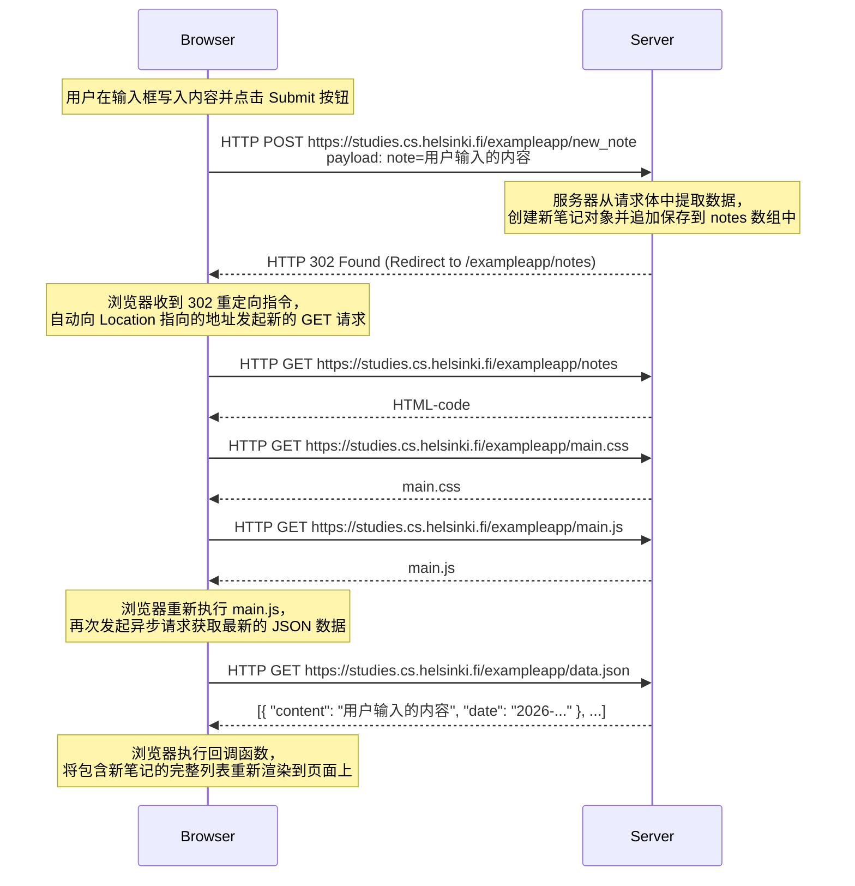

```mermaid
sequenceDiagram
    participant browser as Browser
    participant server as Server

    Note over browser: 用户在输入框写入内容并点击 Submit 按钮

    browser->>server: HTTP POST https://studies.cs.helsinki.fi/exampleapp/new_note<br/>payload: note=用户输入的内容
    
    Note over server: 服务器从请求体中提取数据，<br/>创建新笔记对象并追加保存到 notes 数组中

    server-->>browser: HTTP 302 Found (Redirect to /exampleapp/notes)

    Note over browser: 浏览器收到 302 重定向指令，<br/>自动向 Location 指向的地址发起新的 GET 请求

    browser->>server: HTTP GET https://studies.cs.helsinki.fi/exampleapp/notes
    server-->>browser: HTML-code

    browser->>server: HTTP GET https://studies.cs.helsinki.fi/exampleapp/main.css
    server-->>browser: main.css

    browser->>server: HTTP GET https://studies.cs.helsinki.fi/exampleapp/main.js
    server-->>browser: main.js

    Note over browser: 浏览器重新执行 main.js，<br/>再次发起异步请求获取最新的 JSON 数据

    browser->>server: HTTP GET https://studies.cs.helsinki.fi/exampleapp/data.json
    server-->>browser: [{ "content": "用户输入的内容", "date": "2026-..." }, ...]

    Note over browser: 浏览器执行回调函数，<br/>将包含新笔记的完整列表重新渲染到页面上
```