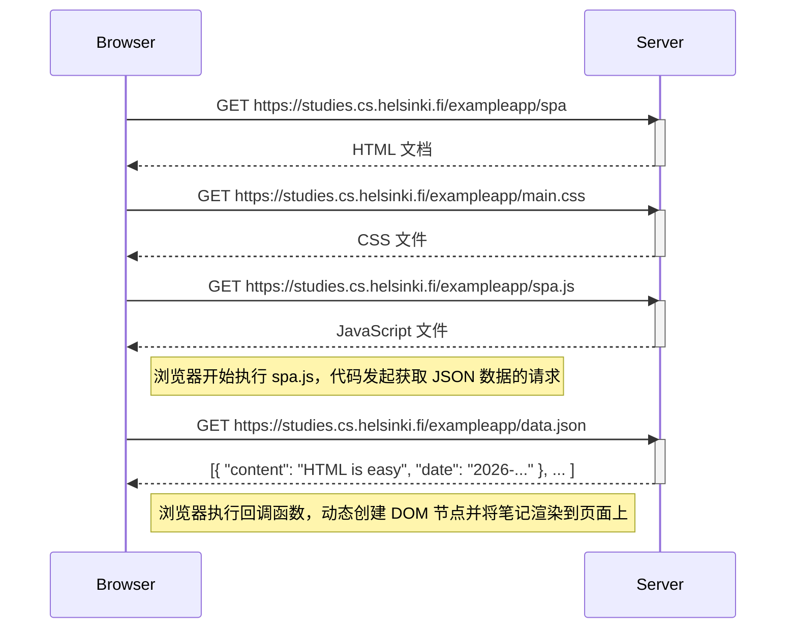

```mermaid
sequenceDiagram
    participant browser as Browser
    participant server as Server

    browser->>server: GET https://studies.cs.helsinki.fi/exampleapp/spa
    activate server
    server-->>browser: HTML 文档
    deactivate server

    browser->>server: GET https://studies.cs.helsinki.fi/exampleapp/main.css
    activate server
    server-->>browser: CSS 文件
    deactivate server

    browser->>server: GET https://studies.cs.helsinki.fi/exampleapp/spa.js
    activate server
    server-->>browser: JavaScript 文件
    deactivate server

    Note right of browser: 浏览器开始执行 spa.js，代码发起获取 JSON 数据的请求

    browser->>server: GET https://studies.cs.helsinki.fi/exampleapp/data.json
    activate server
    server-->>browser: [{ "content": "HTML is easy", "date": "2026-..." }, ... ]
    deactivate server

    Note right of browser: 浏览器执行回调函数，动态创建 DOM 节点并将笔记渲染到页面上
```