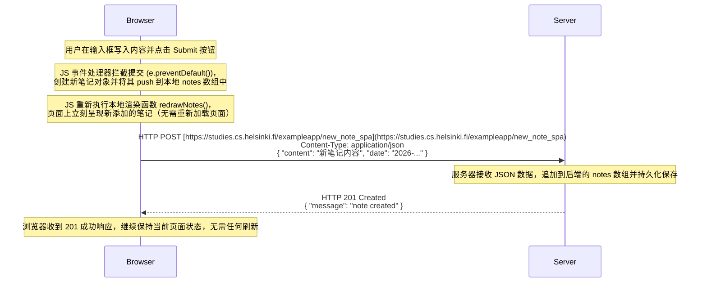

```mermaid
sequenceDiagram
    participant browser as Browser
    participant server as Server

    Note over browser: 用户在输入框写入内容并点击 Submit 按钮

    Note over browser: JS 事件处理器拦截提交 (e.preventDefault())，<br/>创建新笔记对象并将其 push 到本地 notes 数组中

    Note over browser: JS 重新执行本地渲染函数 redrawNotes()，<br/>页面上立刻呈现新添加的笔记（无需重新加载页面）

    browser->>server: HTTP POST [https://studies.cs.helsinki.fi/exampleapp/new_note_spa](https://studies.cs.helsinki.fi/exampleapp/new_note_spa)<br/>Content-Type: application/json<br/>{ "content": "新笔记内容", "date": "2026-..." }

    Note over server: 服务器接收 JSON 数据，追加到后端的 notes 数组并持久化保存

    server-->>browser: HTTP 201 Created<br/>{ "message": "note created" }

    Note over browser: 浏览器收到 201 成功响应，继续保持当前页面状态，无需任何刷新
```